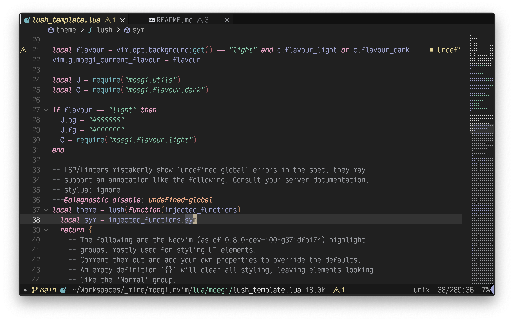
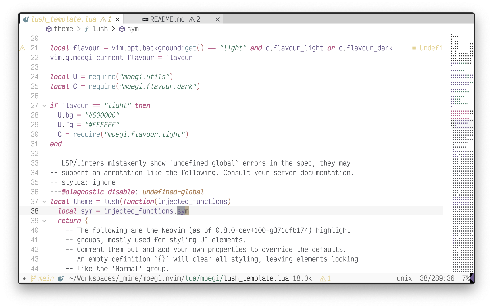
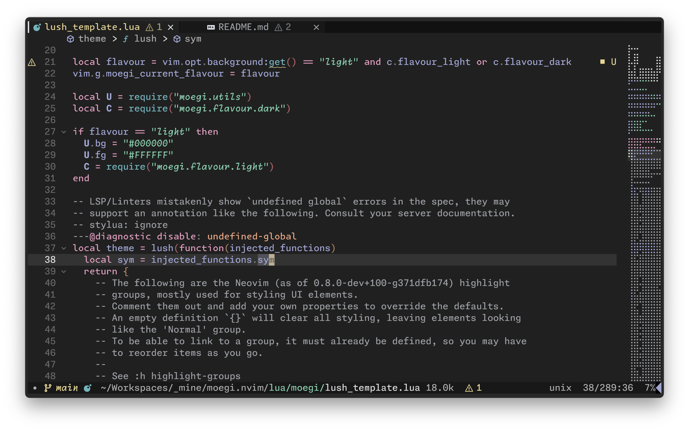
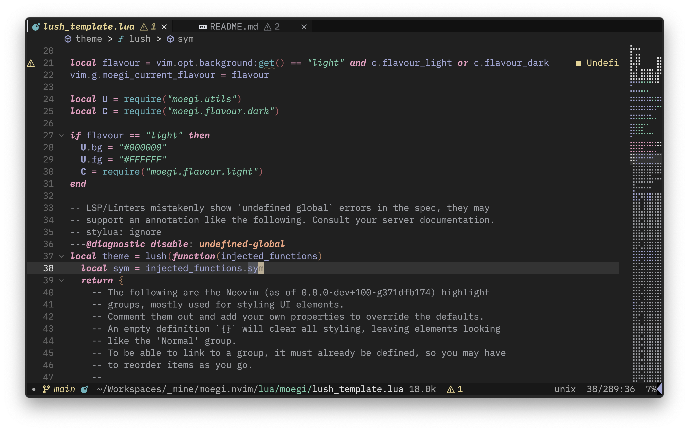

# moegi.nvim

A port of the [moegi](https://github.com/moegi-design/vscode-theme) theme for
neovim. Very alpha stage. Depends on [lush.nvim](https://github.com/rktjmp/lush.nvim).

## Preview

| Dark Preview                             | Light Preview                              |
| ---------------------------------------- | ------------------------------------------ |
|  |  |

| With Monaspace                                       | With IBM Plex Mono                                         |
| ---------------------------------------------------- | ---------------------------------------------------------- |
|  |  |

## Status

- Currently, only two flavours supported: `light` and `dark`.
- A lot of integrations to other plugins are missing.
- Some features may not be identical to the original VSCode theme.

Open an issue or a PR if you want to help!

## Sample Setup

### `lazy.nvim`

```lua
  {
    'inogai/moegi.nvim',
    lazy = false, -- you generally want your colorscheme to load during startup
    priority = 1001,
    dependencies = { 'rktjmp/lush.nvim' }, -- lush is required
    ---@module 'moegi'
    ---@type moegi.Config
    opts = {},
    config = function(_, opts)
      require('moegi').setup(opts)
      vim.cmd.colorscheme('moegi') -- optionally set the colorscheme here
    end,
  },
```

## Configuaration

This is the default configuration. You do not need to specify all of these options.

```lua
{
  flavour_light = "light",
  flavour_dark = "dark",
  constant_gui = "bold",       -- set to "" if you don't want any font style
  string_gui = "italic",
  keyword_gui = "bold italic", -- would look cool if you set "bold italic" to a
                               -- different font, e.g. Monaspace Krypton
  diagnostic_underline_gui = "undercurl", 
                               -- also try "underline"
}
```

## Credits

- Thanks ddiu8081 for his great [VSCode Theme](https://github.com/moegi-design/vscode-theme/)!
- Thanks [rktjmp/lush.nvim](https://github.com/rktjmp/lush.nvim) which makes
  this possible.

- I refered heavily to [cappuccin/nvim](https://github.com/catppuccin/nvim) and
  [ellisonleao/gruvbox.nvim](https://github.com/ellisonleao/gruvbox.nvim) on
  how they organize a colorscheme.

- I borrowed `utils.lua` from [cappuccin/nvim](https://github.com/catppuccin/nvim)
  and `lib/hsluv.lua` from [hsluv/hsluv-lua](https://github.com/hsluv/hsluv-lua),
  see their licenses for details.
